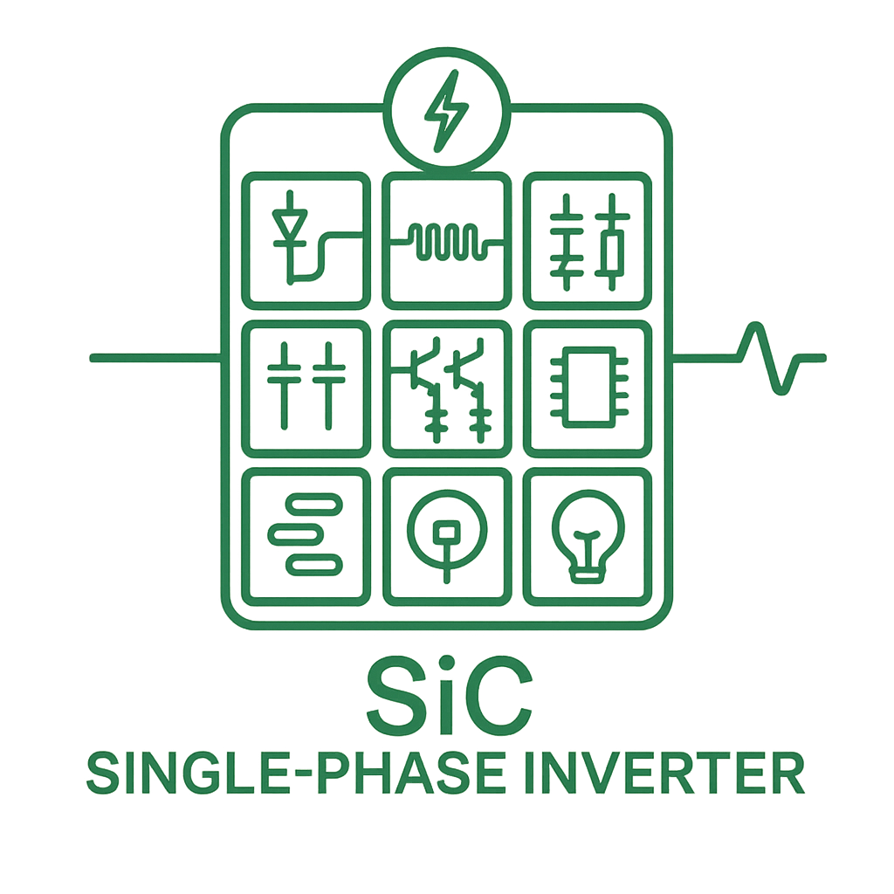
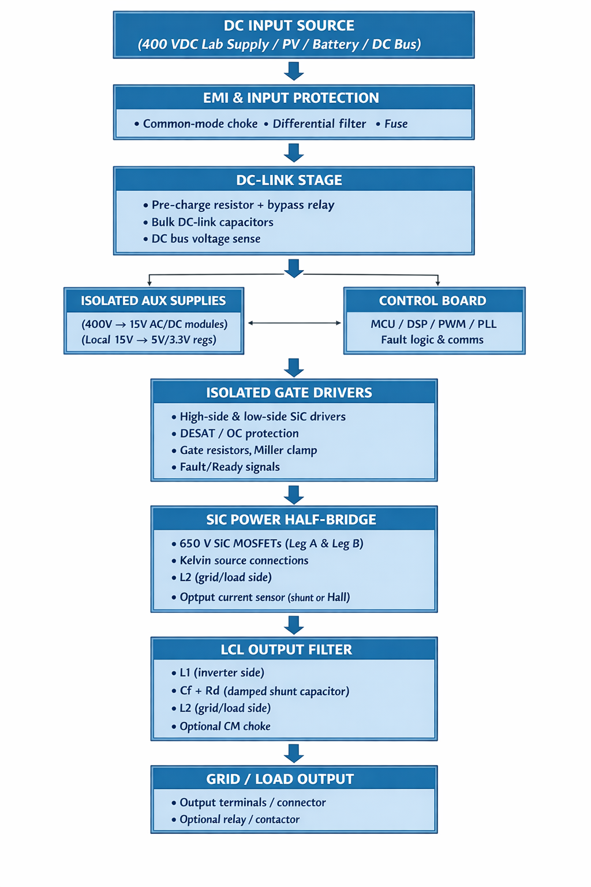

# SiC-Based Modular Inverter System

## Table of Contents
1. [Project Overview](#1-project-overview)  
2. [System Architecture](#2-system-architecture)  
   - [EMI Input Filter](#21-emi-input-filter)  
   - [Pre‑Charge & Inrush Limiting](#22-pre-charge--inrush-limiting)  
   - [DC‑Link Capacitor Network](#23-dc-link-capacitor-network)  
   - [Inverter Power Stage](#24-inverter-power-stage)  
   - [Output LCL Filter](#25-output-lcl-filter)  
3. [Electrical Specifications](#3-electrical-specifications)  
4. [Development Tools & Equipment](#4-development-tools--equipment)  
5. [Current Status](#5-current-status)  
6. [System Block Diagram](#6-system-block-diagram)

---

## 1. Project Overview

This project is a **modular, SiC‑based single‑phase inverter system** designed using professional engineering practices and a clean, hierarchical architecture. Each functional block is implemented as its own PCB, enabling:

- **Modularity** — swap, upgrade, or debug subsystems independently  
- **Scalability** — expand to higher power levels or new control architectures  
- **Serviceability** — isolate issues quickly during bring‑up  
- **Educational clarity** — each PCB teaches a specific power‑electronics concept  

Key design principles:

- **Hierarchical schematics** (KiCad 9)  
- **Modular PCBs** (EMI filter, pre‑charge, DC‑link, inverter legs, LCL filter, power supplies, controller)  
- **High‑performance SiC MOSFETs** for fast switching and low losses  
- **Low‑inductance DC‑link layout**  
- **Safe, lab‑friendly bring‑up** (initially 60 VDC)  

The long‑term goal is a **flexible, open inverter platform** suitable for experimentation, research, and future expansion.

---

## 2. System Architecture

The inverter is divided into well‑defined functional blocks.

### 2.1 EMI Input Filter
- Differential‑mode LC filter  
  - **L_DM:** `2300HT-470-H-RC`  
  - **C_IN:** `R71PI410050H6K`  
- Common‑mode choke: `7448258022`  
- Provides clean, low‑noise DC to downstream stages  
- **Outputs:** `BUS+_Filtered`, `BUS-_Filtered`

---

### 2.2 Pre‑Charge & Inrush Limiting
- Limits inrush current to **~5 A**  
- Uses an **80 Ω** pre‑charge resistor  
- MOSFET/relay bypass for full‑power operation  
- Interfaces between EMI filter and DC‑link  
- **Outputs:** `DC+`, `DC−`

---

### 2.3 DC‑Link Capacitor Network
- **Bulk Storage:** 220 µF electrolytic (10 × `ESH226M500AL4AA`)  
- **High‑Frequency Film:** 10 µF polypropylene (5 × `MKP1848C52050JK2`)  
- Provides:
  - Energy storage  
  - Low‑impedance switching current path  
  - Reduced ripple and overshoot  

---

### 2.4 Inverter Power Stage
- **Topology:** Full‑bridge using SiC MOSFET half‑bridge legs  
- **Switching Devices:** 4 × Wolfspeed `C3M0025065K`  
- **Gate Drivers:** 4 × TI `UCC21710QDWRQ1` isolated drivers  
- **Sensing:** Placeholders for output current and DC bus voltage (future work)  
- **Control:** PWM interface for microcontroller or DSP  

---

### 2.5 Output LCL Filter
- Shapes PWM into low‑distortion 60 Hz AC  
- Reduces switching ripple and protects the load  
- **Components:**
  - **Series Inductors:**  
    - `L1`: 470 µH (`Bourns 1140-471K-RC`)  
    - `L2`: 470 µH (`Bourns 1140-471K-RC`)  
  - **Shunt Capacitor:**  
    - `C_F`: 6.8 µF, 305 Vac MKP (`KEMET C4AF9BW4680T3FK`)  
  - **Damping Resistor:**  
    - `R_D`: ~10 Ω, ≥3 W (`TE 3-2176794-3`)  
- **Design Target:**  
  - Resonant frequency ≈ 2 kHz  
  - Damped to avoid resonance peaking  

---

## 3. Electrical Specifications

| Parameter | Value | Notes |
|----------|-------|-------|
| **Input Voltage Range** | 335–425 VDC | |
| **Nominal DC Bus Voltage** | 400 VDC | |
| **Output Voltage** | 120 Vrms | Single‑phase AC |
| **Output Frequency** | 60 Hz | |
| **Continuous Power** | 500 W | |
| **Peak Power** | 1 kW | |
| **Continuous Current (RMS)** | 4.1 Arms | Output |
| **Continuous Current (DC)** | 1.25 A | Input at nominal voltage |
| **Switching Frequency** | 40 kHz | Initial target |
| **Target Inrush Current** | < 5 A | Pre‑charge limited |
| **DC‑Link Capacitance** | 220 µF electrolytic + 10 µF film | |
| **Capacitor Voltage Rating** | >500 V | |
| **Output Filter Topology** | LCL | 470 µH – 6.8 µF – 470 µH |

---

## 4. Development Tools & Equipment
- **CAD:** KiCad 9 (hierarchical design)  
- **Version Control:** Git  
- **Documentation:** draw.io, Markdown  
- **Bench Tools:** Oscilloscope, isolated supplies, differential probes  
- *(More tools will be added as the project grows)*  

---

## 5. Current Status

- [x] EMI filter — **Complete**  
- [x] Pre‑charge topology — **Defined**  
- [x] DC‑link architecture — **Defined**  
- [x] KiCad hierarchy — **Modular & clean**  
- [x] Pre‑charge components added  
- [x] DC‑link capacitor bank added  
- [x] Inverter leg schematic started  
- [x] Output LCL filter populated with real parts  
- [x] Inverter + LCL interaction reviewed in simulation  
- [x] Power‑stage support rails (+15V ISO, +3V3 logic)  
- [x] Controller selected  
- [ ] Controller wiring  
- [ ] Layout of sub‑PCBs  
- [ ] System wiring and integration  

---

## 6. System Block Diagram

